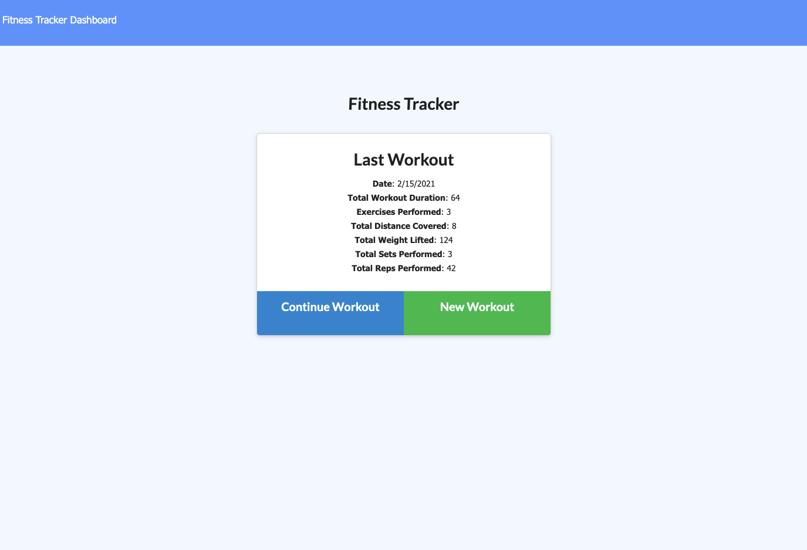
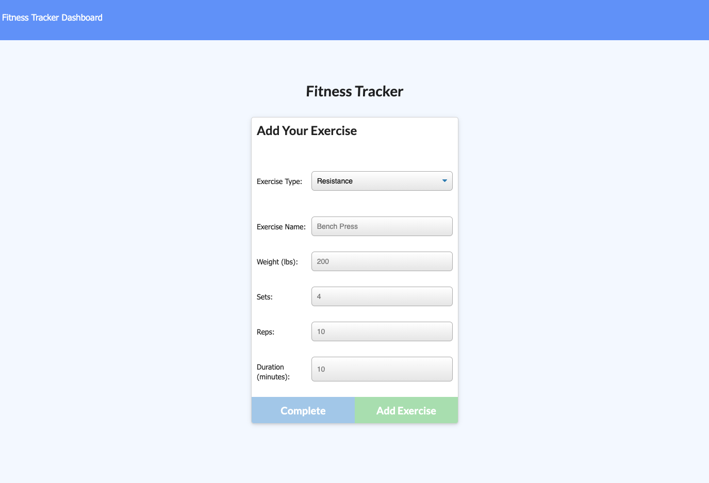
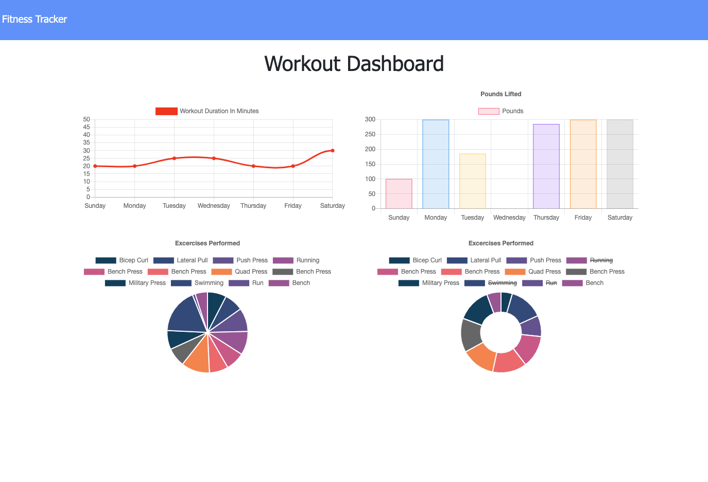

# 17_workout_app

## Table of Contents

* [Description](#description)
* [Installation](#installation)
* [Usage](#usage)
* [Videos](#videos)
* [License](#license)
* [Contributing](#contributing)
* [Tests](#tests)
* [Questions](#questions)

-----

## Description

This was a homework assignment where the challenge was to create the backend of a workout tracking application that relied on MongoDB (NoSQL). The application allows users to view, create, and track daily workouts. They can log multiple exercises in a workout on a given day, and they are also to track the name, type, weight, sets, reps, and duration of resistance exercises. If the exercise is a cardio exercise, they are able to track the distance traveled.

**Please Note:** The front-end code was provided, and the dashboard utilized [Chart.js](https://www.chartjs.org/).

Example images:

-----

## Installation

This application is currently deployed, and it can be viewed at the following link:

* [Workout Tracker](https://tmk-exercise-tracker.herokuapp.com/)

Those interested in installing this application should take the following steps:

1. Run the command `npm i` to ensure the correct Node Modules are installed prior to running the application.
2. Create a MongoDB database called "workout" on your local machine.
3. Run the command `npm run seed` to load the sample data to the "workout" database as a new "workouts" collection.
4. Run the command `npm start` to start up the application on your local host.

-----

## Usage

From the Home Page, the following functions are available:

1. Click on "Continue Workout" to add additional exercises to the "Last Workout" displayed.
2. Click on "New Workout" to create a new workout by adding an exercise.
3. Click on "Dashboard" to view charts of the previous 7 days of workouts.

-----

## License

This project does not have a license.

-----

## Contributing

This application was a homework assignment, and further contributions are not needed.

-----

## Tests

There are no specific tests provided for this application; however, in the event any issues are discovered, feel free to contact me using one of the methods below.

-----

## Questions

If you have any questions about this project, please free to contact me through my [Github profile](https://github.com/timothykemp) or via [email](mailto:timothymichaelkemp@gmail.com).
  